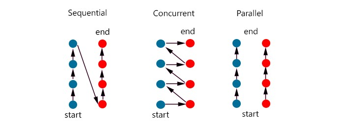

# Concurrent Programing

## Resume Materi

### Differences between Sequential, Parallel, and Concurrent

Sequential: menjalankan program secara berurutan sehingga diperlukan event di line sekarang selesai terlebih dahulu untuk menjalankan event yang selanjutnya.

Parallel: menjalankan program secara bersamaan sehingga proses yang terjadi adalah menguraikan masalah menjadi tugas-tugas yang lebih kecil yang dapat dieksekusi pada saat yang sama.

Concurrent: menjalankan program secara independent sehinggga proses akan dilakukan secara bertahap dengan berjalan bergantian dengan event yang lain. Dalam concurrent programming, dapat dilakukan bersamaan dengan parallel sehingga di saat yang bersamaan, dua concurrent programming berjalan bersama.



### Goroutines

Goroutines adalah fungsi atau method yang berjalan secara concurrently (independen) dengan fungsi atau method lainnya.

Sintaksis Goroutines

Single Goroutine
```go
package main

import (
    "fmt"
    "time"
)

func hello() {
    fmt.Println("Hello world")
}

func main() {
    // cukup tambahkan go pada function yang ingin dijalankan secara concurrently
    go hello() 
    fmt.Println("main function")
    // untuk melihat hasil print, tambahkan sleep agar program tidak langsung selesai
    time.Sleep(1 * time.Second)
}
```

Multiple Goroutine
```go
package main

import (
    "fmt"
    "time"
)

func init() { start = time.Now }

func getChars(sentence string) {
    for _, c := range sentence {
        fmt.Pritnf("%c at time %v\n", c, time.Since(start))
        time.Sleepp(10 * time.Millisecond)
    }
}

func getDigits(digits []int) {
    for _,d := range digits {
        fmt.Printf("%d at time %v\n", d, time.Since(start))
        time.Sleep(30 * time.Millisecond)
    }
}

func main() {
    fmt.Println("main execution started at time", time.Since(start))
    fmt.Println()

    go getChars("Hello")
    go getDigits([]int{1, 2, 3})

    time.Sleep(200 * time.Millisecond)
    fmt.Println("\nmain execution stopped at time", time.Since(start))
}
```

Channel adalah komunikasi objek menggunakan goroutine yang akan berkomunikasi satu sama lain

```go
package main

import "fmt"

func greet(c chan string) {
    data := <-c // store data from c channel
    fmt.Prinltn("Hello " + data + "!")
}

func main() {
    fnt.Println("main() started")
    c := make(chan string)

    go greet(c)

    c <- "John" // push or wwrite data to c channel
    fmt.Println("main() stopped")
}
```

Select untuk memudahkan komunikasi kontrol data melalui satu atau banyak channel

```go
package main

import (
    "fmt"
    "runtime"
)

func getAverage(number []int, ch chan float64) {
    var sum = 0

    for _, e := range numbers {
        sum += e
    }

    ch <- float64(sum)/float64(len(numbers))
}

func getMax(numbers []int, ch chan int) {
    var max = numbers[0]

    for _, e := range numbers {
        if max < e {
            max = e
        }
    }

    cha <- max
}

func main() {
    runtime.GOMAXPROCS(2)
    
    var numbers = []int{3, 4, 3, 5, 6, 3, 2, 2, 3, 4, 6, 3}
    fmt.Println("numbers: ", numbers)

    var ch1 = make(chan float64)
    go getAverage(numbers, ch1)

    var ch2 = make(chan int)
    go getMax(numbers, ch2)

    for i:=0; i<2; i++ {
        select {
            case avg := <- ch1:
                fmt.Printf("Avg\t: %.2f\n", avg)
            case max := <- ch2:
                fmt.Printf("Max\t: %d\n", max)
        }
    }
}
```

### Race Condition

Race conditions adalah dimana 2 thread mengakses memori di waktu yang bersamaan. Kondisi ini muncul karena tidak tersinkronisasinya akses ke shared memory.

Pada source code berikut terjadi race condition dimana dapat dilakukan pengecekan menggunakan tambahan option `-race` sehingga untuk menjalankan program ini sebagai berikut `go run -race [nama_file]`

```go
package main

import "fmt"

func getNumber() int {
    var i int

    go func() {
        i = 5
    }()

    return i
}

func main() {
    fmt.Println(getNumber())
}
```

Untuk meperbaiki data race ada 3 cara yaitu:
1. WaitGroups
    Memblock read access sampai write operation telah berhasil
    ```go
    package main

    import (
        "fmt"
        "sync"
    )

    func getNumber() int {
        var i int
        var wg sync.WaitGroup

        wg.add(1)
        go func() {
            i = 5
            wg.Done()
        }()

        wg.Wait()
        return i
    }

    func main() {
        fmt.Println(getNumber())
    }
    ```
2. Channels Blocking
    Memperbolehkan goroutines untuk sinkronasi dengan yabg lain dalam suatu momen
    ```go
    package main

    import "fmt"

    func getNumber() int {
        var i int
        done := make(chan struct())

        go func() {
            i = 5
            cone <- struct{}{}
        }()

        <- done
        return i
    }

    func main() {
        fmt.Println(getNumber())
    }
    ```
3. Mutex
    Kondisi dimana tidak lagi mempedulikan urutan read dan write tetapi hanya perlu agar keduanya tidak berjalan secara bersamaan
    ```go
    package main

    import (
        "fmt"
        "sync"
        "time"
    )

    type SafeNumber struct {
        val int
        m sync.Mutex
    }

    func  (i *SageNumber) Get() int {
        i.m.Lock()
        defer i.m.Unlock()
        return i.val
    }

    func (i *SafeNumber) Set(val int) {
        i.m.Lock()
        defer i.m.Unlock()
        i.val = val
    }

    func getNumber() int {
        i := &SafeNumber()

        go func() {
            i.Set(5)
        }()

        time.Sleep(time.Second)
        return i.Get()
    }

    func main() {
        fmt.Println(getNumber())
    }
    ```