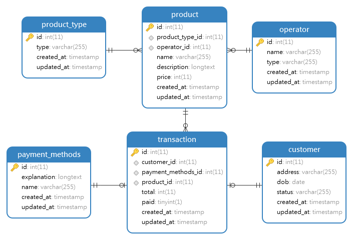
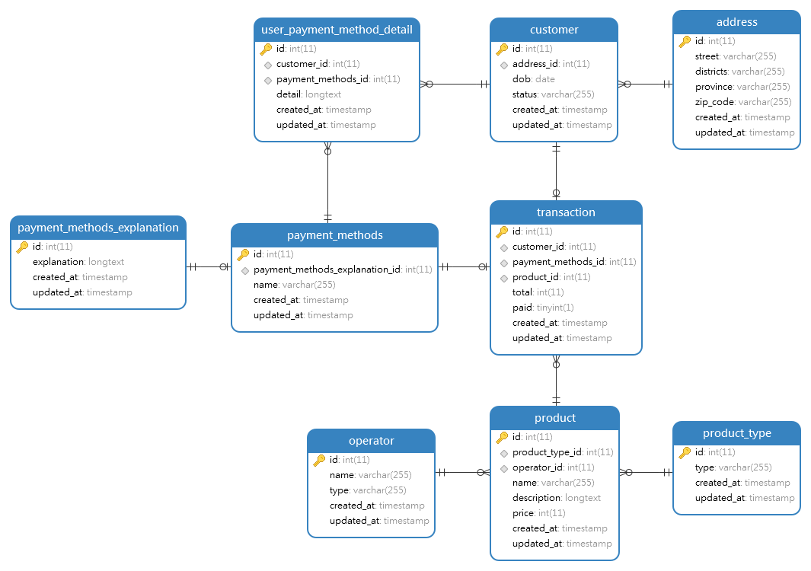

# Praktikum

## Problem 1

Membuat dan menggunakan database outlet_pulsa
```sql
CREATE DATABASE outlet_pulsa;

USE outlet_pulsa;
```

Membuat table product_type
```sql
CREATE TABLE product_type ( 
    id int AUTO_INCREMENT PRIMARY KEY,
    type varchar(255) NOT NULL,
    created_at TIMESTAMP,
    updated_at TIMESTAMP
);
```

Membuat table operator
```sql
CREATE TABLE operator (
    id int AUTO_INCREMENT PRIMARY KEY,
    name varchar(255) NOT NULL,
    type varchar(255) NOT NULL,
    created_at TIMESTAMP,
    updated_at TIMESTAMP
);
```

Membuat table payment_methods
```sql
CREATE TABLE payment_methods (
    id int AUTO_INCREMENT PRIMARY KEY,
    explanation longtext NOT NULL,
    name varchar(255) NOT NULL,
    created_at TIMESTAMP,
    updated_at TIMESTAMP
);
```

Membuat table product
```sql
CREATE TABLE product (
 	id int AUTO_INCREMENT PRIMARY KEY,
    product_type_id int NOT NULL,
    operator_id int NOT NULL,
    name varchar(255) NOT NULL,
    description longtext NOT NULL,
    price int NOT NULL,
    created_at TIMESTAMP,
    updated_at TIMESTAMP,
    CONSTRAINT FK_product_type FOREIGN KEY (product_type_id) REFERENCES product_type(id),
    CONSTRAINT FK_operator FOREIGN KEY (operator_id) REFERENCES operator(id)
);
```

Membuat table customer
```sql
CREATE TABLE customer (
    id int AUTO_INCREMENT PRIMARY KEY,
	address varchar(255) NOT NULL,
    dob date NOT NULL,
    status varchar(255) NOT NULL,
    created_at timestamp,
    updated_at timestamp
);
```

Membuat table transaction
```sql
CREATE TABLE transaction (
 	id int AUTO_INCREMENT PRIMARY KEY,
    customer_id int NOT NULL UNIQUE,
    payment_methods_id int NOT NULL UNIQUE,
    product_id int NOT NULL,
    total int NOT NULL,
    paid boolean NOT NULL,
    created_at TIMESTAMP,
    updated_at TIMESTAMP,
    CONSTRAINT FK_customer FOREIGN KEY (customer_id) REFERENCES customer(id),
    CONSTRAINT FK_payment_methods FOREIGN KEY (payment_methods_id) REFERENCES payment_methods(id),
    CONSTRAINT FK_product FOREIGN KEY (product_id) REFERENCES product(id)
);
```

Untuk melihat query lebih lengkapnya bisa dilihat pada [part2.sql](./part2.sql)

Sehingga untuk ERD akan menjadi sebagai berikut



## Problem 2

```sql
CREATE DATABASE alta_online_shop;

USE alta_online_shop;
```

Mengimplementasikan kembali table pada database outlet_pulsa

Menambah table courier
```sql
CREATE TABLE courier(
    id int NOT NULL AUTO_INCREMENT PRIMARY KEY,
    name varchar(255),
    created_at timestamp,
    updated_at timestamp
);
```

Menambah ongkos_dasar pada table courier
```sql
ALTER TABLE courier ADD ongkos_dasar int;
```

Mengganti nama table courier menjadi shipping
```sql
ALTER TABLE courier RENAME TO shipping;
```

Menghapus table shipping
```sql
DROP TABLE shipping;
```

Mengimplementasikan relasi one to one dengan studi kasus payment method description
```sql
CREATE TABLE payment_methods_explanation (
    id int AUTO_INCREMENT PRIMARY KEY,
    explanation longtext NOT NULL,
    created_at TIMESTAMP,
    updated_at TIMESTAMP
);

CREATE TABLE payment_methods (
    id int AUTO_INCREMENT PRIMARY KEY,
    payment_methods_explanation_id int NOT NULL UNIQUE,
    name varchar(255) NOT NULL,
    created_at TIMESTAMP,
    updated_at TIMESTAMP,
    CONSTRAINT FK_payment_methods_explanation FOREIGN KEY (payment_methods_explanation_id) REFERENCES payment_methods_explanation(id)
);
```

Mengimplementasikan relasi one to many dengan studi kasus user dengan alamat
```sql
CREATE TABLE address (
    id int AUTO_INCREMENT PRIMARY KEY,
    street varchar(255) NOT NULL,
    districts varchar(255) NOT NULL,
    province varchar(255) NOT NULL,
    zip_code varchar(255) NOT NULL,
    created_at TIMESTAMP,
    updated_at TIMESTAMP
);

CREATE TABLE customer (
    id int AUTO_INCREMENT PRIMARY KEY,
	address_id int NOT NULL,
    dob date NOT NULL,
    status varchar(255) NOT NULL,
    created_at timestamp,
    updated_at timestamp,
    CONSTRAINT FK_address FOREIGN KEY (address_id) REFERENCES address(id)
);
```

Mengimplementasikan relasi many to many dengan studi kasus user dengan payment method menjadi user_payment_method_detail
```sql
CREATE TABLE payment_methods (
    id int AUTO_INCREMENT PRIMARY KEY,
    payment_methods_explanation_id int NOT NULL UNIQUE,
    name varchar(255) NOT NULL,
    created_at TIMESTAMP,
    updated_at TIMESTAMP,
    CONSTRAINT FK_payment_methods_explanation FOREIGN KEY (payment_methods_explanation_id) REFERENCES payment_methods_explanation(id)
);

CREATE TABLE user_payment_method_detail (
    id int AUTO_INCREMENT PRIMARY KEY,
    customer_id int NOT NULL,
    payment_methods_id int NOT NULL,
    detail longtext NOT NULL,
    created_at TIMESTAMP,
    updated_at TIMESTAMP,
    CONSTRAINT FK_customer_user_payment_method_detail FOREIGN KEY (customer_id) REFERENCES customer(id),
    CONSTRAINT FK_payment_methods_user_payment_method_detail FOREIGN KEY (payment_methods_id) REFERENCES payment_methods(id)
);

CREATE TABLE customer (
    id int AUTO_INCREMENT PRIMARY KEY,
	address_id int NOT NULL,
    dob date NOT NULL,
    status varchar(255) NOT NULL,
    created_at timestamp,
    updated_at timestamp,
    CONSTRAINT FK_address FOREIGN KEY (address_id) REFERENCES address(id)
);
```

Untuk melihat query lebih lengkapnya bisa dilihat pada [part2.sql](./part2.sql)

Sehingga untuk ERD akan menjadi sebagai berikut

