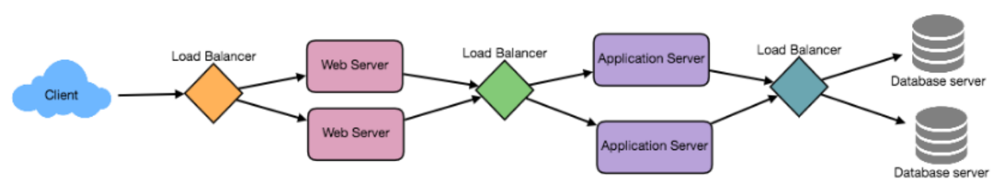

# System Design

## Resume Materi

### Characteristic of Distributed System

1. Scalability
    Scalability is a capability of a system, process, or a network to frow and manage increased demand. Any distributed system that can continously evolve in order to support the growing amount of work is considered to be scalable.
2. Reliability
    Reliability is the probability a system will fail in a given period. In simple terms, a distributed system is considered reliable if it keeps delivering its services seven when one or several of its software or hardware components fail.
3. Avaliability
    Availability is the time a system remains operational to perform its required function in a spesific period. It is a simple measure of the percentage of time that a system, service, or a machine remains operational under normal conditions.
4. Eficiency
    Two standard measures of its efficiency are the response time/latency that denotes the delay tob obatin the first item and the throughput/bandwidth which denotes the number of items delivered in a given time unit.
5. Serviceability or Manageability
    Serviceability or Manageability is the simplicity and speed with which a system can be repaired or maintained. If the time to fix a failed system increases, then avaliabilitu are the ease of diagnosing and understanding problems when they occur, ease of making updates or modifications, and how simple the system is to operate.

### Load Balancing

Load Balance is anothe critical component of any distributed system. It helps to spread the traffic across a cluster of servers to improve responsiveness and avalibility of applications, websites or databases. Load Balancer also keeps track of the status of all the resources while fistributing requests.

To utilize full scalability and redudancy, we can try to balance the load at each layer of the system on three places:
- Between the user and the web server
- Between web servers and an internal platform layer
- Between internal platrform layer and database

### SQL and NoSQL

SQL is relational database and NoSQL is non-relational database. Relational databases are strucutred and have predefined schemas, different with non-relational databse are unstructured and have a dynamic schema.

Differences relational database with non-relational database.

Relational Database:
- tidak bisa menambah data yang tidak sesuai skema
- Perlu menambahkan data NULL pada item yang tidak memiliki data
- Memili tipe data yang strict
- Tidak dapat menambah beberapa item data pada sebuah field

Non-Relational Database:
- Tidak memiliki skem ketika menambah data
- Aplikasi menangani proses validasi tipe data
- Mendukung proses aggregasi dokumen pada item

Tipe Non-Relational Database:
- Key/Value
- Column-family
- Graph
- Document-based
- Othe Geospatial File-system Object