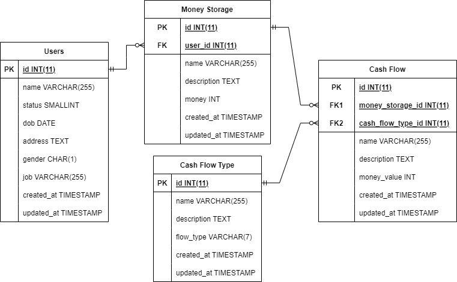
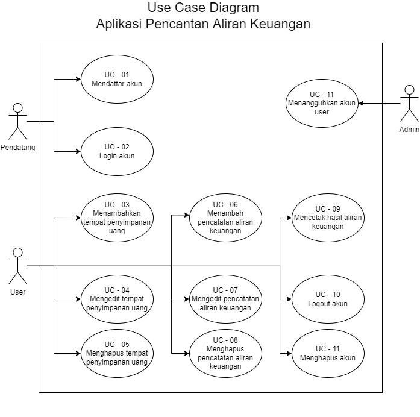

# Praktikum System Design

## Problem 1 - Diagram

1. ERD Aplikasi Pencatatan Pengeluaran Keuangan
    
2. Use Case Diagram Aplikasi Pencatatan Pengeluaran Keuangan
    

## Problem 2 - Query

SQL
```sql
SELECT * FROM users;
```

Redis
```
KEYS *users*
```

Neo4J
```
SHOW DATABASE users YIELD *
```

Cassandra
```
SELECT * FROM system_schema.users;
```