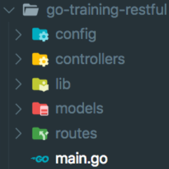

# ORM and Code Structure (MVC)

## Resume Materi

### Object Relational Mapping

Object Relational Mapping (ORM) is a programming technique for converting data between incompatible type systems using object-oriented programming languages.

ORM advantages:
- Less repetetive query
- Automatically fetch data into ready to use object
- Simple way if you want to screening data before store it in database
- Some have feature cache query

ORM disadvantages:
- Add a layer in code and cost the overhead process
- Load unnecessary relationship data
- Complex raw query can be longy to write with ORM (> 10 table joins)
- Spesific SQL function related to one vendor may not supported or no spesific function

### Gorm

Gorm is the fanstastic ORM library for Golang.

Install Gorm
```go
go get -u gorm.io/gorm
go get -u gorm.io/driver/mysql
```

### Code Structuring

Structuring your project using Model-View-Controller (MVC). MVC is a short for Model, View, and Controller. The big idea behind MVC is that each section of your code has a purpose, and those purposes are different. Why we need structure? To achieve to modular application, implement separation of concerns, and less conflict on versioning.

Folder structure for MVC
