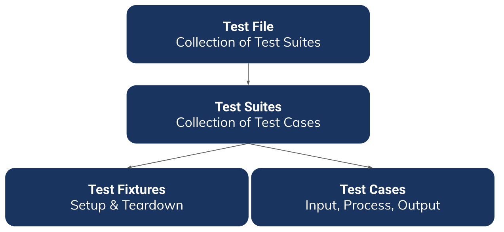

# Unit Testing

## Resume Materi

### Software Testing

Software testing is a process of analyzing a software item to detect the differences between existing and required conditions and to evaluate the features of the software item.

Purpose of testing:
- Preventing regression
- Confidence level in refactoring
- Imporve code design
- Code documentation
- Scalling the team

Level of testing:
1. UI
    End to end testing that test the interaction between the overall through the user interface
2. Integration
    Tests a specific modules or sub-system throguh the API
3. Unit
    Test the smallest testable part (single logical operation or function) of an application thorugh methods

### Testing Framework

Framework provides tool and structure necessary to run testing efficiently.

If using go, you can use Go Testify, but if using JavaScript you can use Mocha or Jest.

### Structure

2 usual pattern:
- Centralize your test file inside tests folder
- Save test file together with production file

Structure testing
