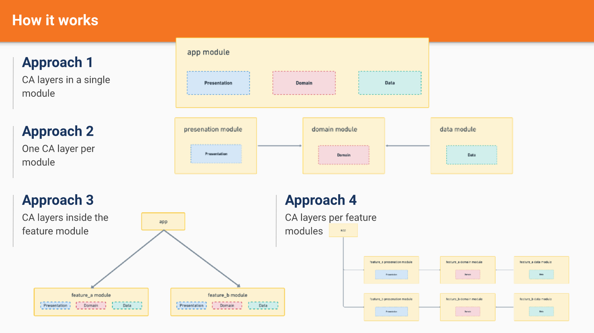

# Clean and Hexagonal Architecture

## Resume Materi

### Clean Architecture

Clean Architecture is the separation of concerns using layers to build a modular, scalable, maintainable, and testable application. By separating every objective of each modular, we can easily to maintain the application because we already know where are the code by the objective. For the implementation before, we already using MVC (Model, View, and Controller).

Constraint:
- Independent of Framework
- Testable
- Independent of UI
- Independent of Database
- Independent of any external

Benefit:
- Standaritation for structure
- Faster development for long term
- Mocking dependencies become trivial in unit test
- Easy to switching from prototypes to proper solution

### CA Layer

CA Layer approach by sepparating 3-layer:
- Use Case - Domain Layer: contains business logic
- Controller - Presentation Layer: presents data to a screen and handle user interactions
- Drivers - Data Layer: manages application data
- Entities Layer (optional): business object as they reflect the concepts that your app manages

### Domain Design Driven

Domain Design Driven (DDD) is a software design approach that focusing on modelling software to match a domain. Under DDD, the structure and language of software code (class names, class methods, class variables) should match the business domain.

Domain-driven design is predicated on the following goals:
- placing the project's primary focus on the core domain and domain logic
- basing complex designs on a model of the domain
- initiating a creative collaboration between technical and domain experts to iteratively refine a conceptual model that addresses particular domain problems.
