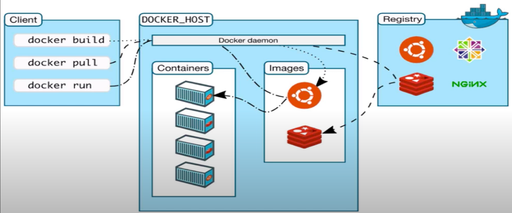

# Docker

## Resume Materi

### What is Docker

Docker is an open platform for developing, shipping, and running applications. Docker enables you to separate your applications from your infrastructure so you can deliver software quickly. With Docker, you can manage your infrastructure in the same ways you manage your applications.

### Container

Container is not a virtual machine. Container is a process with file system isolation.

| Container                                                          | Virtual Machine                                     |
|--------------------------------------------------------------------|-----------------------------------------------------|
| Abstraction at the app layer                                       | Abstraction of physical hardware                    |
| Containers take up less space then VM                              | Each VM includes a full copy of an operating system |
| Handle more applications and require fewer VM and Operating System | Also be slow to boot                                |

### Docker

Docker basics:
- Image
- Container
- Engine
- Registry
- Control Plane

Docker Infrastructure

What you can do with Docker

Docker Command
| Syntax     | Definition                                     |
|------------|------------------------------------------------|
| FROM       | Getting image from docker registry             |
| RUN        | Execute bash command when building container   |
| ENV        | Set variable inside container                  |
| ADD        | Copy the file with some other process          |
| COPY       | Copy the file                                  |
| WORKDIR    | Set working directory                          |
| ENTRYPOINT | Execute command when finish building container |
| CMD        | Execute command but can be overwrite           |