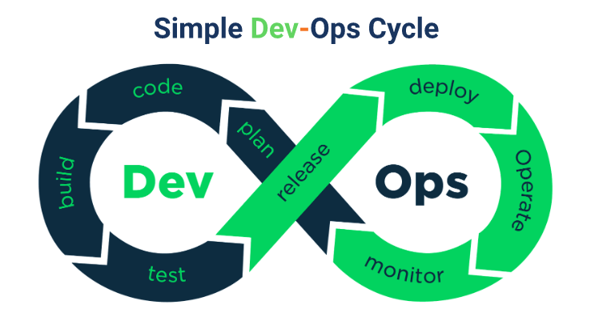

# Computer Services

## Resume Materi

### System & Software Development

Deployment adalah kegiatan yang bertujuan untuk menyebarkan aplikasi/produk yang telah dikerjakan oleh para pengembang seringkali untuk mengubah dari status sementara ke permanen. Penyebarannya dapat melalui beragam cara tergantung dari jenis aplikasinya, aplikasi web dan api server sedangkan aplikasi mobile ke playstore/appstore.

### Strategi Deplyment

1. Big-Bang Deployment Strategy / Replace Strategy
2. Rollout Deploymeny Strategy
3. Blue/Green Deployment Strategy
4. Canary Deployment Strategy

### Simple Dev-Ops Cycle

