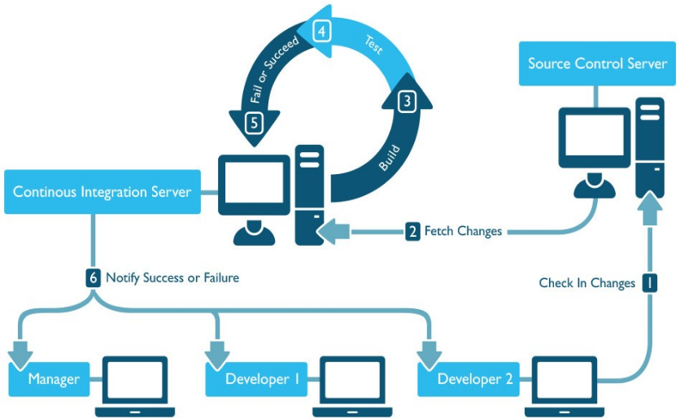
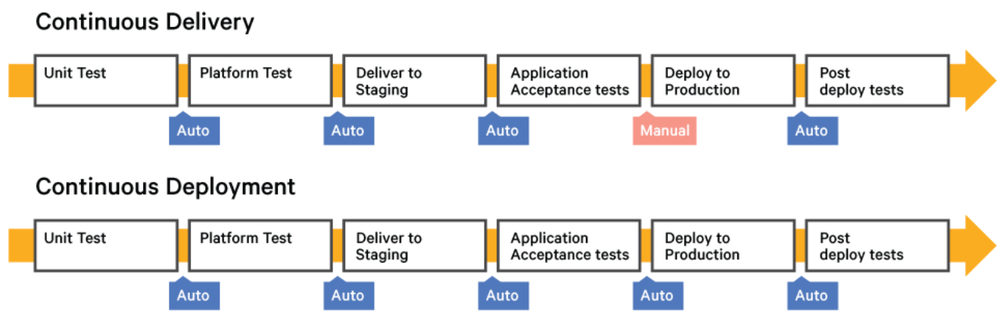
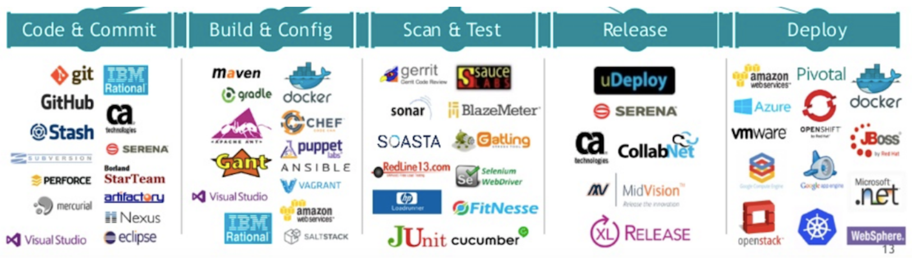

# CI/CD

## Resume Materi

### Continuous Integration (CI)

CI is an automated process. It is done in order to integrate various codes from different potetntial sources in order to build it or test it.

The Cycle

### Continuous Delivery Development (CD)

Continuous Deployment process goes one step further than the integration and delivery process. The  pipeline of continuous deployment automatically deploys each and every build that have been verified.

The Cycle

### Tools

