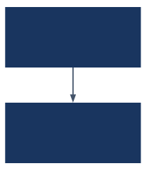
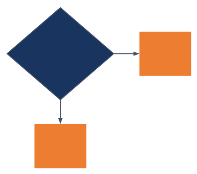
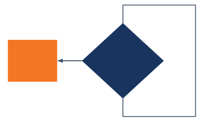
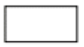

# Introduction to Algorithm and Golang

## Resume Materi

### Algoritma

Algoritma adalah prosedur komputasi yang didefinisikan dengan baik yang mengambil beberapa nilai sebagai input dan menghasilkan beberapa nilai sebagai output.

Berikut algoritma dasar yang akan digunakan
| Jenis      | Deskripsi                                                                                      | Bentuk                                                 |
|------------|------------------------------------------------------------------------------------------------|--------------------------------------------------------|
| Seuqential | Serangkaian tindakan yang diselesaikan dalam urutan tertentu                                   |  |
| Branching  | Mencocokan dengan kondisi untuk menentukan tindakan mana yang diambil pada langkah selanjutnya |    |
| Looping    | Urutan yang dieksekusi beberapa kali selama kondisi yang telah ditentukan terpenuhi            |        |

### Pseudocode

Pseudocode adalah bahasa buatan dan informal yang membantu programmer mengembangkan algoritma. Pseudocode adalah alat desain detail (algoritmik) yang berbasis teks.

### Flowchart

Flowchart adalah suatu bagan dengan simbol tertentu yang menggambarkan urutan dan hubungan antar proses secara mendetail.

Berikut simbol flowchart yang akan digunakan
| Nama            | Simbol                                                           |
|-----------------|------------------------------------------------------------------|
| Mulai / Selesai |                      |
| Proses          |                    |
| Input / Output  |  |
| Perkondisian    |        |
| Perulangan      |            |