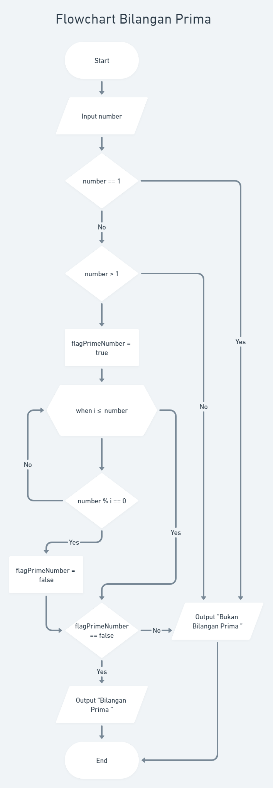
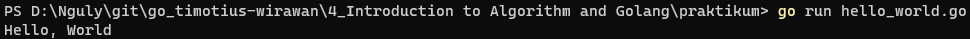

# Praktikum Introduction to Golang and Algorithm

## Problem 1 - Bilangan Prima
Buatlah flowchart untuk menentukan bilangan prima

## Problem 2 - Lampu dan Tombol
Buatlah flowchart untuk alogritma tersebut

## Problem 3 - Install Golang
Berikut hasil pengecekan versi golang menggunakan terminal

## Problem 4 - Hello World!
Berikut hasil screenshot output hello world menggunakan terminal
